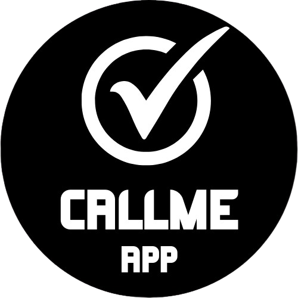
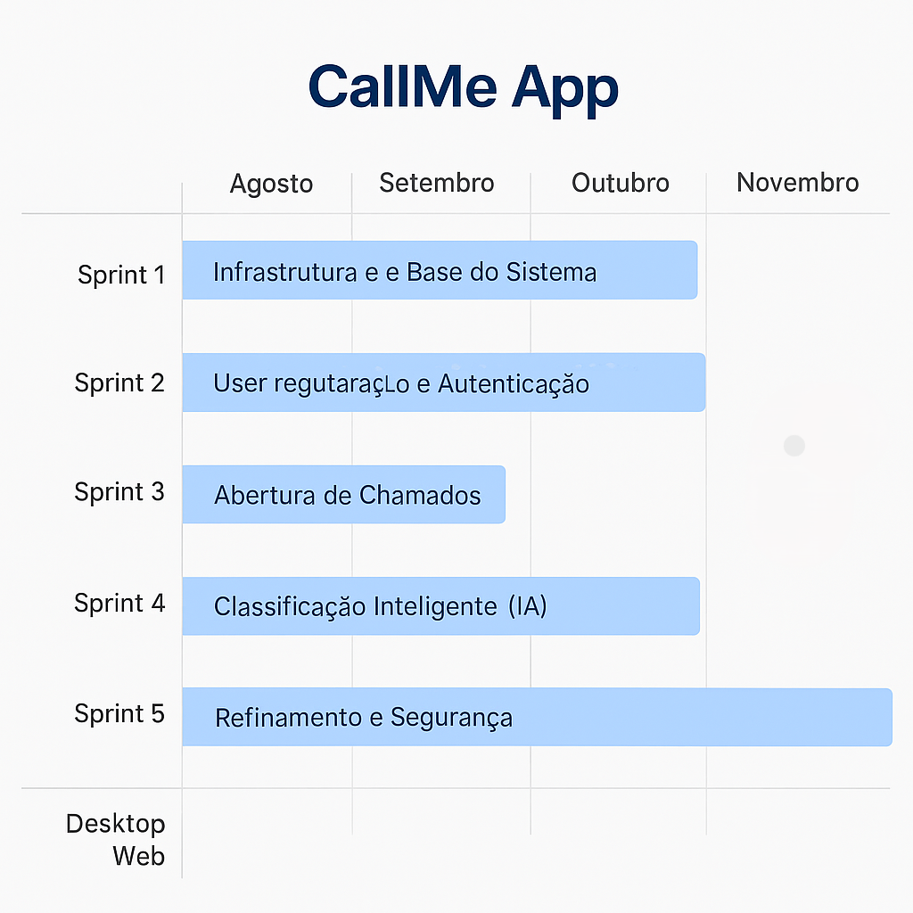
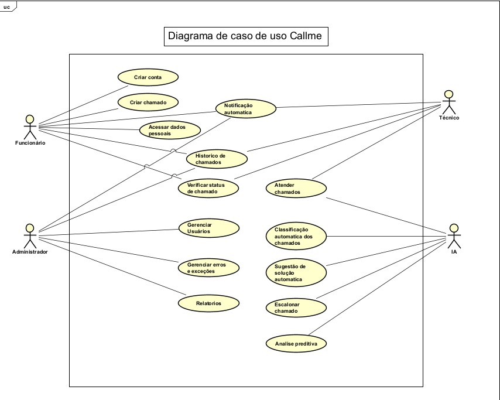

<h1 align="center">
  
  <br>
  Callme App
</h1>

<p align="center">🚀 O futuro do atendimento com inteligência artificial</p>

<div align="center">

[]()
[]()
[]()
[]()

</div>

---

## 📖 Sobre o Projeto  

O **Callme App** é um aplicativo mobile para **abertura e gerenciamento de chamados** por funcionários para a assistência técnica, com suporte integrado de **IA**.  

🔹 Funcionários abrem chamados no app.  
🔹 A **IA** recebe o chamado e sugere uma solução imediata.  
🔹 Caso não seja resolvido, o chamado é **encaminhado automaticamente ao técnico responsável**.  

O desenvolvimento foi feito com **React Native + TypeScript**, utilizando **Scrum** como metodologia ágil.  

> 🎯 Motivação: A ideia surgiu devido à insatisfação com softwares existentes que não oferecem integração com inteligência artificial.  

---

#  Backlog do Produto

### Sprint 1: Estrutura e Preparação do Ambiente
- Configuração completa do ambiente de desenvolvimento e integração com ferramentas de versionamento (Git).
- Criação e configuração do banco de dados SQL Server, definindo tabelas e relacionamentos iniciais.
- Definição da arquitetura modular do sistema, garantindo escalabilidade e facilidade de manutenção.
- Implementação das primeiras camadas de segurança, incluindo criptografia de senhas e autenticação básica.

### Sprint 2: Módulo de Usuários e Autenticação
- Desenvolvimento do cadastro de usuários com validação de dados e tratamento de erros.
- Implementação do sistema de login e autenticação, contemplando diferentes níveis de permissão (usuário comum, técnico, administrador).
- Realização de testes unitários e de integração para assegurar estabilidade e funcionamento correto

### Sprint 3: Gestão de Chamados
- Criação da funcionalidade para abertura e acompanhamento de chamados.
- Desenvolvimento da interface de exibição e filtragem de chamados por status e prioridade.
- Integração com o banco de dados e realização de testes de consistência e desempenho. 

### Sprint 4: Inteligência Artificial e Automação
- Treinamento inicial da IA de classificação, utilizando histórico de chamados (com dados simulados, se necessário).
- Implementação da sugestão automática de soluções com base em padrões identificados.
- Ajustes e refinamentos no modelo de IA a partir dos resultados dos testes.

### Sprint 5: Otimização, Segurança e Entrega Final
- Aplicação de melhorias de segurança avançadas (como tokens JWT e políticas de acesso).
- Refatoração do código e ajustes na arquitetura para otimizar desempenho e legibilidade.
- Elaboração da documentação técnica e do usuário, além de testes finais de validação e usabilidade.
- Configuração de logs e monitoramento básico do sistema para manutenção contínua.

---
## Cronograma de Evolução

---

## 🛠️ Tecnologias Utilizadas  

- [React Native](https://reactnative.dev/)  
- [TypeScript](https://www.typescriptlang.org/)  
- [Node.js](https://nodejs.org/pt)  
- [Android Studio](https://developer.android.com/studio)  
- [Astah UML](https://astah.net/products/astah-uml/)  
- [Trello](https://trello.com/)  

---

## 📂 Estrutura do Repositório  

- **/Callme/Modelagem_de_Requisitos** → Diagramas, backlog, casos de uso  
- **/Callme/PIM** → Documentação acadêmica (PIM 3º semestre)  
- **/Callme/code** → Código-fonte do app  

---

## 🗒️ Documentação  

- [📌 Diagramas UML](https://github.com/Nilo40/AtividadeEgydio/Callme/Modelagem_de_Requisitos/Diagrama_de_caso_de_uso_sistema_corrigido.asta)  
- [📌 Sprint Backlog](https://github.com/Devluisgsouza/Callme_App/blob/main/Callme/Modelagem_de_Requisitos/Sprints_Backlog.docx)  
- [📌 Casos de Uso](https://github.com/Devluisgsouza/Callme_App/blob/main/Callme/Modelagem_de_Requisitos/Descrição_caso_de_uso.docx)  
- [📌 Documentação Completa](https://github.com/Devluisgsouza/Callme_App/blob/main/Callme/PIM/PIM%203%20SEMESTRE.doc)  



---
| Período da Sprint   | Link para Documentação da Sprint                                                  | Link para Vídeo no YouTube do Incremento                                   |
|---------------------|----------------------------------------------------------------------------------|---------------------------------------------------------------------------|
| Sprint 1 (19-08/26-08) | [Documentação Sprint 1](https://link-da-documentacao-da-sprint1)                 | [Vídeo Sprint 1](https://youtube.com/link-do-video-sprint1)                |
| Sprint 2 (26/08-02/09) | [Documentação Sprint 2](https://link-da-documentacao-da-sprint2)                 | [Vídeo Sprint 2](https://youtube.com/link-do-video-sprint2)                |
| Sprint 3 (02/09-09/09) | [Documentação Sprint 3](https://link-da-documentacao-da-sprint3)                 | [Vídeo Sprint 3](https://youtube.com/link-do-video-sprint3)                |

---

## 🚀 Como Rodar o Projeto  

### Pré-requisitos  
- [Android Studio](https://developer.android.com/studio)  
- [Node.js](https://nodejs.org/pt)  
- [Expo CLI](https://expo.dev/)  

### Passo a passo  

```bash
# Clone o projeto
$ git clone https://github.com/Devluisgsouza/Callme_App.git 

# Entre no diretório
$ cd Callme/code

# Instale as dependências
$ npm install

# Instale o Expo CLI (caso não tenha)
$ npm install -g expo-cli

# Inicie o projeto
$ npx expo start

```bash
    # Conectar o código ao emulador android
    $ npm run android
```

## Dev do Projeto

| Nome do Aluno         | RA      | Turma   |
|-----------------------|---------|---------|
| Danilo Alves da Silva | R080CJ$ | DS4P48  |
